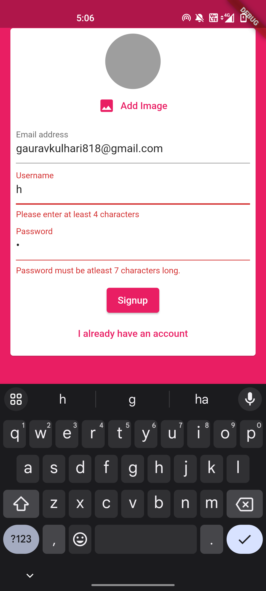
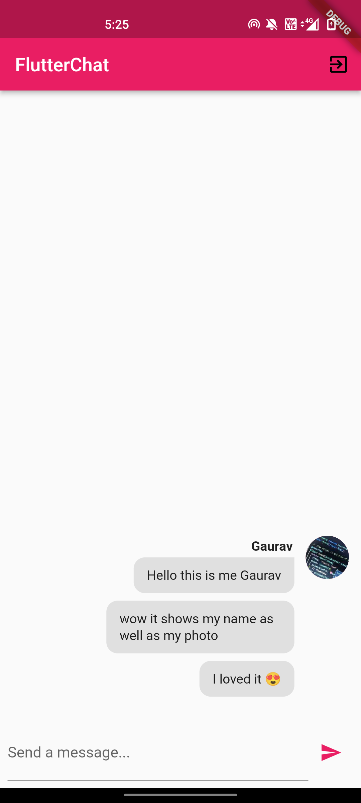
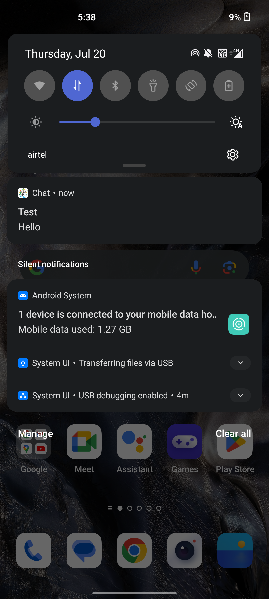
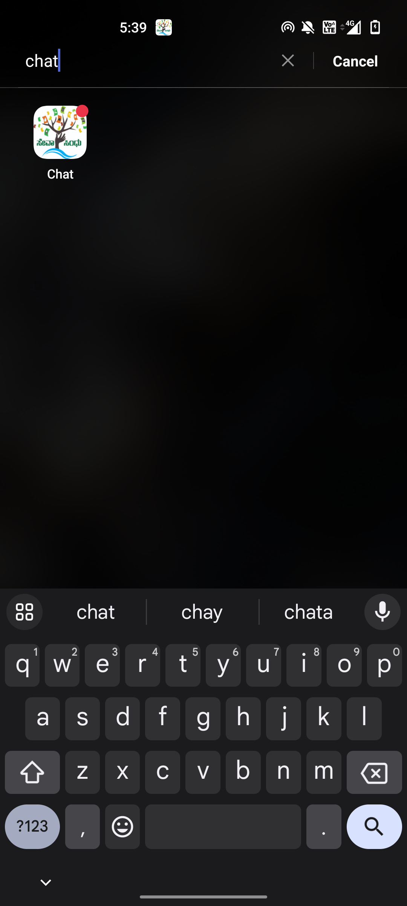

## Kriyo.io

Kriyo.io is a full-featured chat app template in Flutter, dart for Android. This application has an attractive and easy-to-use UI integrated with features like Firebase Authentication, Storage, and push notifications. Implemented real-time messaging functionality using Firebase Firestore and used functions to notify users about new messages, even when the application is not actively running.

### Built With

- Flutter
- Dart
- Firebase

## Screenshots

Authentication Screen       |  Form Validation         | Exception Handling        |  Login Screen
:-------------------------:|:-------------------------:|:-------------------------:|:-------------------------:
||||

User Messaging              |  RealTime Messaging      | Push Notifications        |  App Icon
:-------------------------:|:-------------------------:|:-------------------------:|:-------------------------:
||||

## Features
- Register & Sign In
- Add Profile Picture
- Real-Time messaging
- Easy LogOut Access
- Log in from any Device
- Separation of Messages based on User
